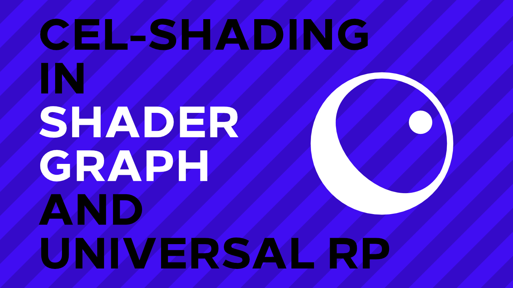

# Cel-shading in Shader Graph and URP
A cel-shading tutorial for Unity Universal Render Pipeline and Shader Graph.

## Overview

This project is an introduction to Shader Graph and Universal Render Pipeline. An accompanying tutorial article is available on [danielilett.com](https://danielilett.com/2020-03-21-tut5-urp-cel-shading/) - it'll make a lot more sense if you follow along on there!

## Software

This project was created using Unity 2019.3.0f6 and Universal Render Pipeline 7.1.8.

## Authors

This project, and the corresponding tutorial series, were written by Daniel Ilett. [Follow him on Twitter](https://twitter.com/daniel_ilett) for more gamedev tutorials!

## Release

This project was released on March 21st, 2020. No more updates are planned, but more Shader Graph content will be coming to [danielilett.com](https://danielilett.com/) soon!
